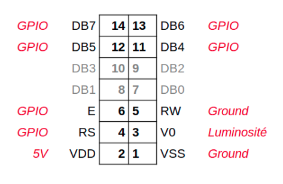

#  Sommaire
*  [LCD](#LCD)
*  [SDA_SCL_Multiple](#SDA_SCL_Multiple)


# LCD
L’écran LCD 0802 du kit KS0522


```bash
sudo pip3 install adafruit-circuitpython-charlcd --break-system-packages
```




[voir la documentation](https://docs.circuitpython.org/projects/charlcd/en/latest/index.html)

```python
import board
import digitalio
import adafruit_character_lcd.character_lcd as CharLCD
from time import sleep

## board.D1 = GPIO 1, board.D2 = GPIO 2, etc.
## Mettez ici les valeurs qui correspondent à vos connexions
RS = digitalio.DigitalInOut(board.D1)
E = digitalio.DigitalInOut(board.D1)
DB7 = digitalio.DigitalInOut(board.D1)
DB6 = digitalio.DigitalInOut(board.D1)
DB5 = digitalio.DigitalInOut(board.D1)
DB4 = digitalio.DigitalInOut(board.D1)

cols = 8
rows = 2

lcd = CharLCD.Character_LCD(RS,E,DB4,DB5,DB6,DB7,cols,rows)

lcd.message = "hello"
sleep(1)
lcd.cursor_position(5,1)
lcd.message = "bye"
sleep(1)
lcd.clear()

```

Une manière simple de contrôler le contraste de l’écran est de brancher la broche 3 sur le signal d’un potentiomètre.

# SDA_SCL_Multiple

